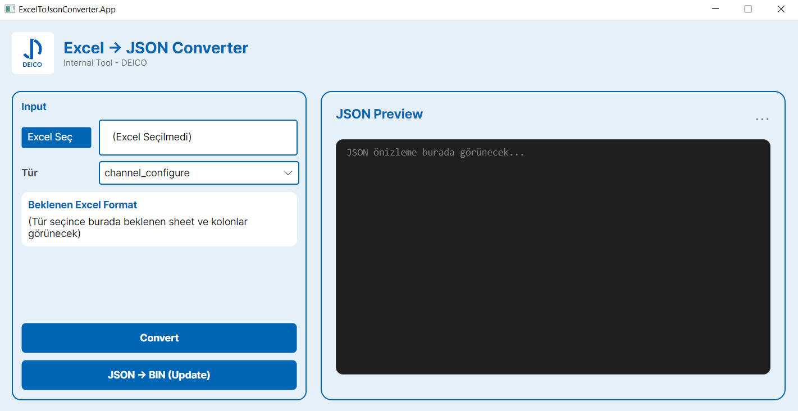
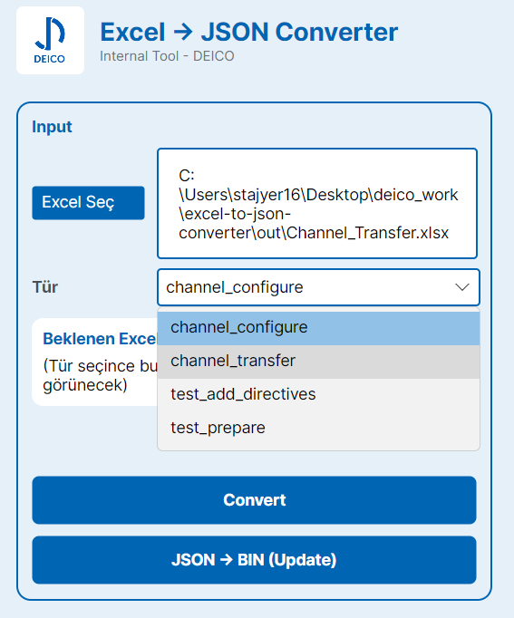
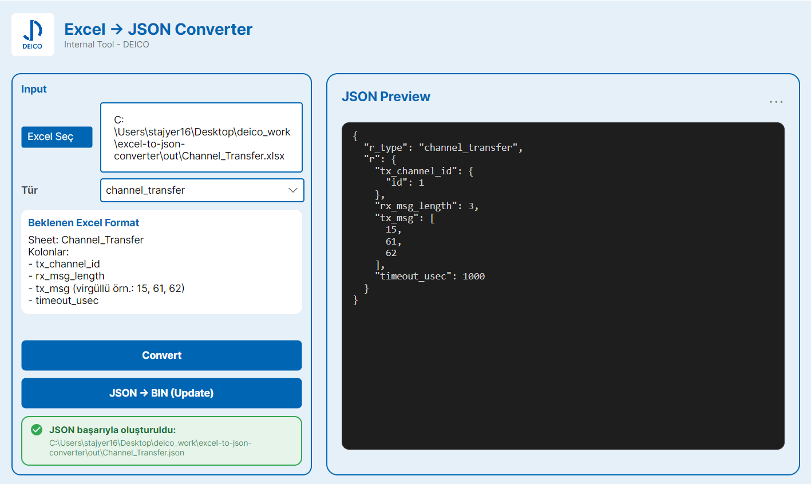
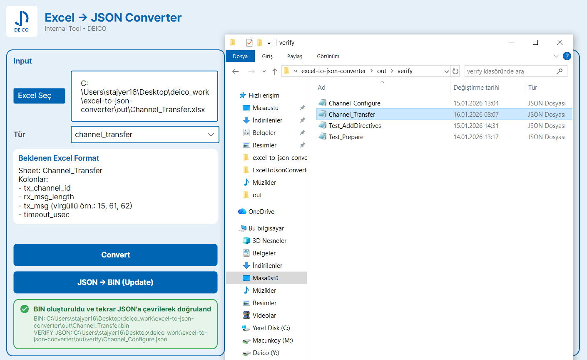

# Excel -> JSON -> FlatBuffers (.bin) Converter

## 1. Projenin Amacý

Bu proje, belirli bir formatta hazýrlanmýþ **Excel dosyalarýndan**:

- Seçilen isteðe (request type) uygun **JSON** üretmek
- Bu JSON’u **FlatBuffers** kullanarak **.bin** formatýna çevirmek
- Üretilen **.bin** dosyasýný tekrar **JSON’a çevirerek doðrulamak**

amacýyla geliþtirilmiþtir.

Bu sayede:

- Konfigürasyon hatalarý erken aþamada yakalanýr
- FlatBuffers dönüþümünün kayýpsýz olduðu garanti edilir
- Cihaza gönderilecek veriler test edilebilir hale gelir

---

## 2. Desteklenen Request Türleri

Uygulama þu request türlerini destekler:

- `channel_transfer`
- `channel_configure`
- `test_add_directives`
- `test_prepare`

> Kullanýcý bir tür seçtiðinde, uygulama **beklenen Excel formatýný ekranda açýkça gösterir.**

---

## 3. Proje Klasör Yapýsý

```
excel-to-json-converter/
|
+- ExcelToJsonConverter.App/
|  +- MainWindow.axaml
|  +- MainWindow.axaml.cs
|  +- ExcelToJsonConverter.App.csproj
|
+- schemas/
|  +- rft.fbs                  # FlatBuffers schema
|
+- Tools/
|  +- flatbuffers/
|     +- win-x64/
|        +- flatc.exe          # FlatBuffers compiler
|
+- out/                        # Otomatik üretilen çýktýlar
|  +- <ExcelAdi>.json
|  +- <ExcelAdi>.bin
|  +- verify/
|     +- *.json                # BIN -> JSON doðrulama çýktýlarý
|
+- README.md

```

!! **out/** klasörü çýktý klasörüdür, repoya eklenmesi önerilmez.

---

## 4. Gereksinimler

Uygulamanýn çalýþtýrýlabilmesi için aþaðýdaki gereksinimler saðlanmalýdýr:

- **Windows** iþletim sistemi
- **.NET SDK** (projede kullanýlan sürüm)
- **Excel dosyalarý** (`.xlsx`, `.xlsm`)
- **FlatBuffers compiler** (`flatc.exe`)

FlatBuffers derleyicisi proje içerisinde hazýr olarak bulunmaktadýr:

---

## 5. Uygulamanýn Kullanýmý

### Adým 1 – Uygulamayý Çalýþtýr

Visual Studio veya `dotnet run` ile uygulamayý baþlat.

Örnek: 
**Ekran Görüntüsü (Ana ekran)**

 

---

### Adým 2 – Excel Dosyasýný Seç

`Pick Excel` butonuna basarak Excel dosyasýný seç.

Örnek: 
**Ekran Görüntüsü (Excel seçimi)**

 

---

### Adým 3 – Request Türünü Seç

ComboBox üzerinden request türünü seç:

- `channel_configure`
- `channel_transfer`
- vb.

Seçim yapýldýðýnda, sað tarafta **beklenen Excel formatý** otomatik gösterilir.

Örnek: 
**Ekran Görüntüsü (Tür seçimi + format açýklamasý)**



---

### Adým 4 – Convert (Excel -> JSON)

`Convert` butonuna basýldýðýnda:

- Excel okunur
- Seçilen tipe uygun JSON üretilir
- JSON, Excel ile **ayný isimle** kaydedilir

Örnek:
**Ekran Görüntüsü (Convert sonrasý baþarýlý çýktý)**



---

### Adým 5 – Update (JSON -> BIN + Doðrulama)

`JSON -> BIN (Update)` butonuna basýldýðýnda:

- JSON `out/` klasörüne yazýlýr
- `flatc.exe` çaðrýlýr
- `.bin` dosyasý üretilir
- Üretilen `.bin`, tekrar JSON’a çevrilir
- Doðrulama çýktýsý `out/verify/` altýna yazýlýr

Örnek: 
**Ekran Görüntüsü (Update + doðrulama sonucu)**



---

## 6. Round-Trip Doðrulama Nedir?

Bu proje þu akýþý doðrular: Excel -> JSON -> BIN -> JSON


Amaç:

- FlatBuffers dönüþümünde veri kaybý var mý?
- JSON schema ile birebir uyumlu mu?

Bu adým özellikle **saha ve cihaz entegrasyonu öncesi kritik öneme sahiptir.**

---

## 7. Teknik Detaylar

- Excel okuma: **ClosedXML**
- JSON üretimi: **System.Text.Json**
- FlatBuffers iþlemleri: **flatc.exe**
- Proses yönetimi: **ProcessStartInfo**
- Hata yönetimi: **try/catch + kullanýcýya açýklayýcý mesajlar**

---

## 8. Bilinen Kýsýtlar

- `channel_configure` için þu an yalnýzca **RS-485** arayüzü desteklenmektedir.
- **UDP yapýlandýrmasý**, farklý Excel formatý ve farklý JSON üretimi gerektirdiðinden
  bilinçli olarak kapsam dýþýnda býrakýlmýþtýr.

---

## 9. Geliþtirici

**Melda Hacer Çetin**  
Software Engineering Student  
Excel -> JSON -> FlatBuffers Converter

---

## 10. Not

Bu proje;

- Konfigürasyon güvenliðini artýrmak
- Veri doðrulamasýný otomatik hale getirmek
- Test öncesinde hatalarý erken aþamada tespit etmek

amacýyla **þirket içi kullaným için geliþtirilmiþtir.**


